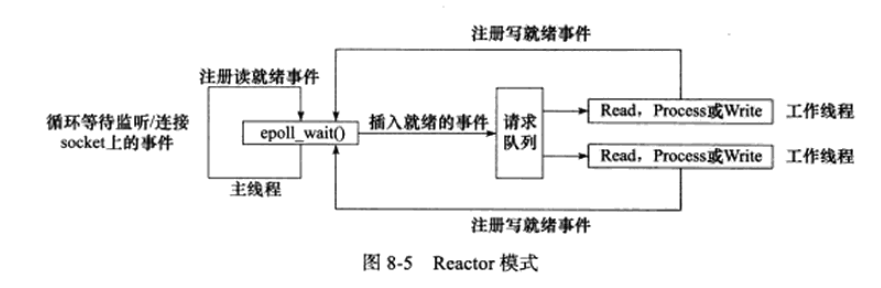
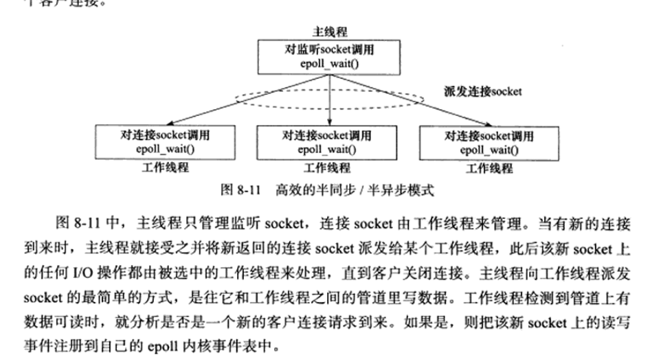
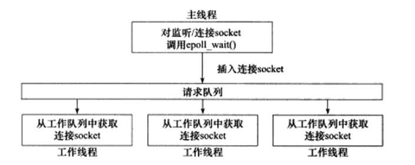

# 事件处理模式

## reactor模式

主线程只负责监听文件描述符上是否有事情发生，但是不进行具体的IO和逻辑操作。有事情发生时，将事情加入请求队列中，并通知工作线程处理。读写数据，接受新的连接，处理客户请求均在工作线程中完成。

IO部分和逻辑处理部分没有明显的界限。

## proactor模式

监听事件是否发生，以及IO操作由主线程来处理。工作线程完成业务逻辑。IO部分和逻辑处理部分有明显的界限。

# 并发模型

## 高效半同步/半异步模型

为了避免线程间传递文件描述符，将接收新连接的操作放在工作线程中。

## 半同步/半反应堆模型

# 并发模型的设计

- 使用高效的半同步/半异步的模型。one thread one loop.
- 使用Round Robin算法，分配connfd。
- 不需要请求队列，只需要线程池。
- 为了避免线程间传递文件描述符，将接收新连接的操作放在工作线程中。

# 究竟什么是Reactor模式

